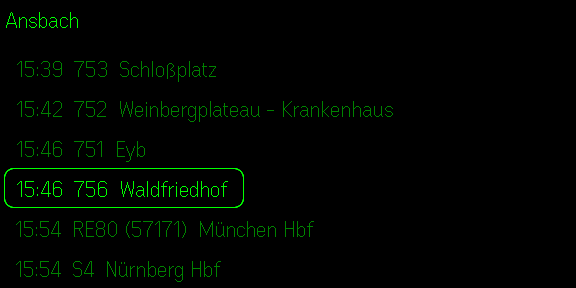

# abfahrtszeit-g2

Even-G2-Plugin, das die naechsten Abfahrten des OePNV rund um den eigenen
Standort anzeigt. Ablauf: Standort ermitteln -> Haltestellen in der Naehe
auflisten -> Haltestelle antippen -> Abfahrten von Bus, Tram, S-/U-Bahn und
Zug sehen.

Datenquelle ist [Transitous](https://transitous.org) (MOTIS v2,
`api.transitous.org`) - eine freie, deutschland- und europaweite OePNV-API
auf Basis der DELFI-GTFS-Feeds inkl. Echtzeit. Keine API-Keys noetig.

> Hinweis: Urspruenglich war die HAFAS-API der Deutschen Bahn
> (`v6.db.transport.rest`) geplant. Die ist inzwischen deutschlandweit
> abgeschaltet (nur regionale HAFAS-Instanzen laufen noch). Transitous ist
> der offene, nationale Ersatz mit demselben Funktionsumfang fuer diese App.

## Screenshots

Brillen-Display (576 x 288, monochrom gruen), Beispiel Bahnhof Ansbach:

| Haltestellen in der Naehe | Abfahrten (Bus + Zug) | Fahrtverlauf einer Fahrt |
|---|---|---|
|  |  |  |

Die Abfahrtsliste mischt alle Verkehrsmittel (Bus 751/752/753, RE80 nach
Muenchen, S4 nach Nuernberg) und blendet eine Datumszeile ein, sobald das
Datum wechselt. Ein Tipp auf eine Abfahrt zeigt den kompletten Halteverlauf
dieser Fahrt ab der eigenen Haltestelle.

## Bedienung auf der Brille

- **Swipe hoch/runter** — durch die Liste scrollen
- **Einfachtipp** —
  Haltestelle → Abfahrten, Abfahrt → Fahrtverlauf (alle Halte der Fahrt).
  Datums-Trennzeilen (`-- Mo 27.07. --`) sind nicht anwaehlbar.
- **Doppeltipp** — eine Ebene zurueck (Fahrtverlauf → Abfahrten →
  Haltestellen); auf der Haltestellenliste beendet der Doppeltipp das Plugin

## Standort

Das Plugin ermittelt den Standort in dieser Reihenfolge:

1. **`bridge.getAppLocation()`** — native Ortung ueber die Even-App (SDK ab
   0.0.12). Nutzt die iOS/Android-Standortfreigabe der App und funktioniert
   auch im Prototype-Betrieb ueber `http://<LAN-IP>`. Voraussetzung: die
   Even-App hat in den Systemeinstellungen die Ortungsfreigabe.
2. **`navigator.geolocation`** — GPS der WebView, nur bei sicherem Origin
   (HTTPS); im http-Prototype blockiert.
3. **IP-Geolocation** — grober Fallback (`ipwho.is`, dann `ipapi.co`).

Im Simulator wird i. d. R. der IP-Fallback verwendet (Titel zeigt dann `(ca.)`).

**Test-Override:** Mit den URL-Parametern `?lat=..&lon=..` laesst sich ein
fester Standort erzwingen — praktisch fuer den Simulator und reproduzierbare
Screenshots, z. B. Bahnhof Ansbach:

```bash
evenhub-simulator "http://localhost:5173/?lat=49.2994&lon=10.5794"
```

## Handy-Seite

Die Brille zeigt das eigentliche UI. Das Flutter-WebView auf dem Handy darf
aber nicht leer sein (Store-Review-Anforderung), deshalb rendert
[`src/phone.ts`](src/phone.ts) dort eine begleitende Seite: App-Identität,
Live-Liste der Haltestellen in der Nähe (dieselben Daten wie die Brille) und
Bedienhinweise. Gestaltet nach den Even Phone-Side-Tokens (hell/dunkel), Akzent
sparsam, nie das Brillen-Grün.

## Sprachen

Die Oberfläche ist zweisprachig (Deutsch/Englisch). Die Sprache wird beim Start
aus `navigator.language` (der Systemsprache im WebView) abgeleitet, Fallback
Englisch. Alle UI-Texte liegen in [`src/i18n.ts`](src/i18n.ts); Fahrplandaten und
Eigennamen (Haltestellen, Linien) bleiben unübersetzt. Zum Testen lässt sich die
Sprache per `?lang=de` bzw. `?lang=en` erzwingen.

## Voraussetzungen

- Node 20 LTS oder 22+
- Globale Tools: `npm install -g @evenrealities/evenhub-cli @evenrealities/evenhub-simulator`
- Even-Realities-App mit aktiviertem Developer Mode (hub.evenrealities.com)

## Entwickeln

```bash
./setup.sh          # npm install + git init mit richtiger Identitaet
npm run dev         # Terminal 1: Vite-Dev-Server
evenhub-simulator http://localhost:5173   # Terminal 2: Simulator
```

## Auf der Brille testen

```bash
ipconfig getifaddr en0                    # LAN-IP des Macs
evenhub qr --url "http://<LAN-IP>:5173"   # QR-Code erzeugen
```

QR-Code mit der Even-Realities-App scannen. Handy und Mac muessen im
selben Netz sein, Firewall und WLAN-Client-Isolation beachten.

## Packen und einreichen

```bash
npm run build
evenhub pack app.json dist -o abfahrtszeit-g2.ehpk
```

Das globale `evenhub`-Binary nutzen, nicht `npx evenhub` (das sucht ein
npm-Paket und schlägt fehl). Die `.ehpk` dann im Dev Portal
(hub.evenrealities.com) einreichen. Das Menü-Icon `docs/icon-24.png` wird im
Portal separat hochgeladen, es steckt nicht in der `.ehpk`.
